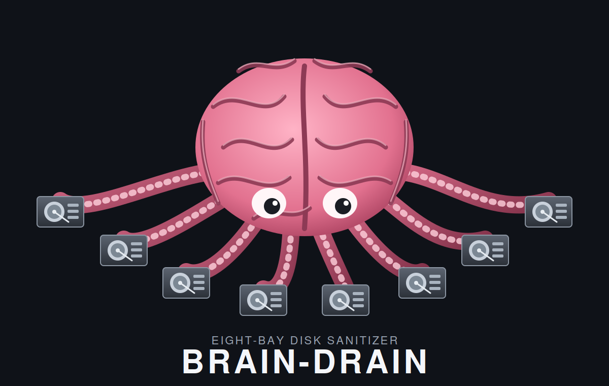
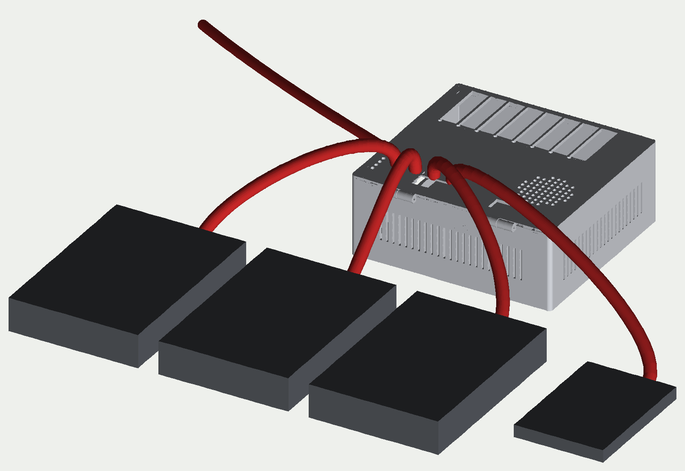
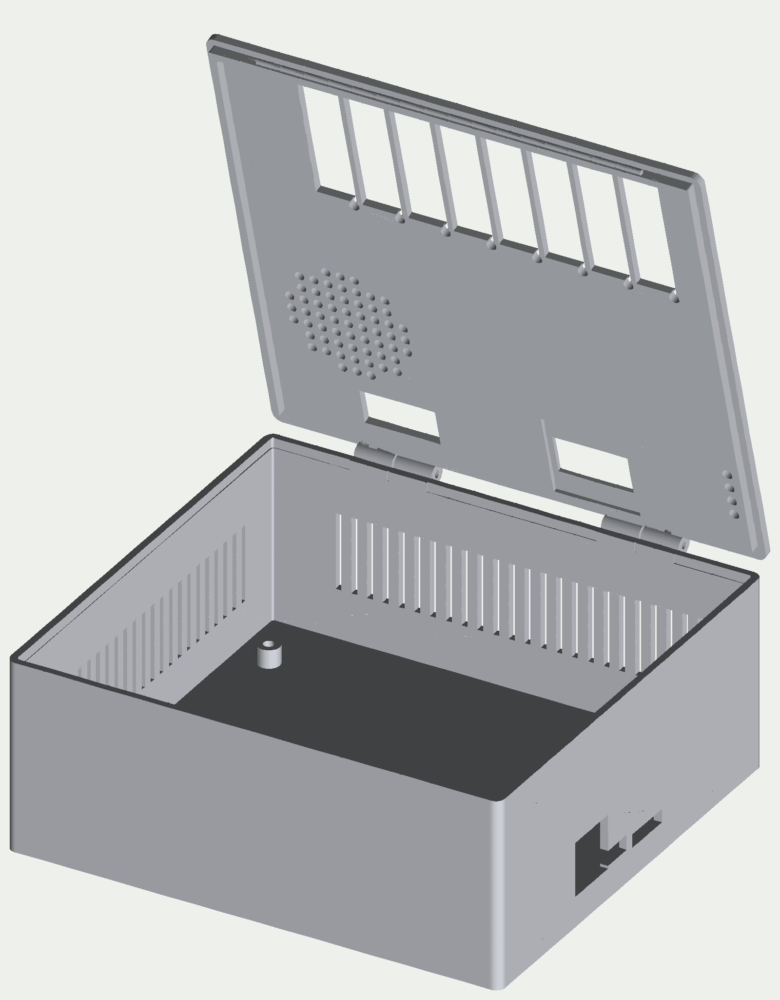
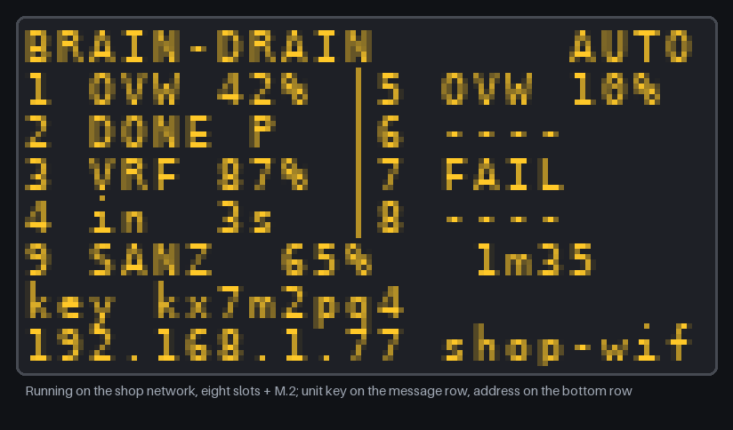

<p align="center"></p>

# brain-drain

A standalone four-bay (plus one M.2) disk sanitizer: plug a drive in, it gets
wiped to NIST SP 800-88 Rev. 2 and you get a certificate. No buttons, no
screen to poke at, no PC. A Raspberry Pi Compute Module 5 on a custom carrier
board, a Python service, and a 3D-printed enclosure.

> **Status: design phase, nothing fabricated yet.** Schematic, board, software
> and enclosure all exist as a first version; the first bench test with a real
> drive is scheduled for 2026-09-26. See [docs/STATUS.md](docs/STATUS.md).
> The hardware was re-laid out on 2026-09-23 as a portable "brain box"
> (decisions C21–C24): a brain board with eight plug-in bay cards (four fitted
> in v1), the unit, its brick and cables in a backpack, drives loose on the
> bench while they are wiped, the lid pops open for an M.2 SSD, and a phone
> joins the unit's own Wi-Fi by scanning a QR code on the OLED. No Ethernet,
> no fan, no buzzer.

<p align="center"></p>
<p align="center"></p>

## What it does

* Up to eight SATA bays as plug-in cards (four fitted), each a USB 3 bridge
  with its own switched power. Drives are not docked: each bay is a 0.5 m
  22-pin SATA cable (data + power) that plugs straight onto a bare 3.5" or 2.5"
  drive lying on the bench. Plus an M.2 NVMe bay under the lid. Each bay is
  independent.
* Set the policy on an 8-way DIP switch. Plug a drive in: it is identified,
  wiped, verified and reported. Unplug it: the job aborts. That is the whole UI.
* Methods follow NIST 800-88 Rev. 2: single-pass overwrite with full
  verification for magnetic drives, firmware Sanitize (crypto or block erase)
  for SSDs and NVMe, legacy 3-pass and 7-pass available for those who insist.
* A JSON certificate per drive per job: what was attempted, what worked, how it
  was verified, and which tier (Clear / Purge) is honestly claimed.
* A 128×64 OLED shows per-bay progress and ETA. When idle it shows a QR code:
  scan it with a phone to join the unit's Wi-Fi, open the address, and you get
  the status page, the certificates to download, the log, and the option to
  join the unit to your own network. A key on the screen authorises changes.
  DIP mode 110 resets Wi-Fi (or everything, with DIP 8) without a network.

<p align="center"> </p>

## Use cases

* IT refresh: wiping a pile of decommissioned laptop and desktop drives
  unattended, four at a time, with paperwork for each.
* Reselling or donating hardware where a Purge-level record is wanted.
* Small MSPs and repair shops that need a repeatable wipe without dedicating a PC.

## Repository layout

| Directory | Workstream | State |
|---|---|---|
| [`hardware/`](hardware/README.md) | KiCad 9: brain board 150 × 122 mm (CM5 wireless, 2× USB5744, eight bay slots, M.2) and the 45 × 46 mm bay card (ASM1153E, switched power, SATA receptacle) | schematic 0 ERC errors; v3 outline placed, 83 % of connections autorouted (all signal nets, most plane pins, 21 of 48 pairs), the QFN supply pins and pair matching remain (STATUS R4/R22, D7/D8); SATA footprint pending a drawing |
| [`software/`](software/README.md) | `braindrain` Python service, simulator, bench tool, Wi-Fi access point + phone page, Pi deployment | 74 tests, ready for the first bench |
| [`enclosure/`](enclosure/README.md) | OpenSCAD "brain box": tray, hinged lid with eight cable windows and a snap latch, OLED bezel; about 157 × 145 × 62 mm | STLs export, renders, not printed |
| [`docs/`](docs/README.md) | architecture, BOM, decisions, status, usage, diagrams | |

## Quick start

```
# simulate the appliance on any Linux box
cd software && python3 -m venv .venv && . .venv/bin/activate && pip install -e ".[dev]"
braindrain simulate --grace 2            # terminal 1
braindrain sim-plug 1 --size 1G --prefill # terminal 2: a drive appears in bay 1 and is wiped

# regenerate the hardware from its source
cd hardware && python3 tools/symgen.py && python3 tools/gen_sch.py && python3 tools/gen_pcb.py

# export the enclosure and its renders
cd enclosure && make && make renders
```

More in [docs/USAGE.md](docs/USAGE.md).

## Documentation

* [Architecture](docs/ARCHITECTURE.md) · [System block diagram](docs/img/system-block.png)
* [Bill of materials](docs/BOM.md) · [Fabrication and assembly vendors, cost estimate](docs/FABRICATION.md) · [Decisions](docs/DECISIONS.md)
* [Status and remaining work](docs/STATUS.md) · [Testing tracker](docs/testing-tracker.md)
* [Usage](docs/USAGE.md) · [Bench plan for 2026-09-26](docs/saturday-bench-plan.md)
* [AGENT.md](AGENT.md) rules for agents and contributors · [CHANGELOG](CHANGELOG.md)

## Safety

This device destroys data by design. The software's safety fence only ever
targets whole disks behind an allow-listed USB bridge on a configured bay port,
or the M.2 slot, and never anything mounted or holding the root filesystem.
Treat every drive that touches a bay as gone.

## Licence

[Polyform Noncommercial 1.0.0](LICENSE): you may use, modify and share this
project for noncommercial purposes. Commercial use needs permission from the
author. Applies to the hardware sources, the software and the enclosure alike.
