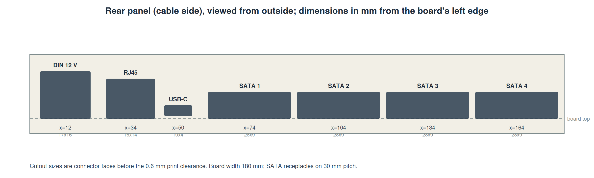

# brain-drain documentation

| Document | What it is for |
|---|---|
| [ARCHITECTURE.md](ARCHITECTURE.md) | The design: hardware, software, enclosure, cross-cutting rules. Source of truth for intent. |
| [STATUS.md](STATUS.md) | What is done, what is placeholder, what is blocked, what comes next. |
| [USAGE.md](USAGE.md) | How to run the simulator, the bench tool, the Pi service, and how to regenerate hardware and enclosure files. |
| [BOM.md](BOM.md) | Parts list with prices and sourcing notes; machine-readable copy in `hardware/bom/`. |
| [DECISIONS.md](DECISIONS.md) | Every decision, open (`D<n>`) or closed (`C<n>`), with reasons. |
| [decisions/](decisions/) | The longer briefs behind the bigger decisions. |
| [testing-tracker.md](testing-tracker.md) | Tested vs validated, per interface and part. |
| [saturday-bench-plan.md](saturday-bench-plan.md) | Step-by-step plan for the first real-drive bench, 2026-09-26. |
| [plans/](plans/) | Multi-session work plans (none yet). |
| [HISTORY.md](HISTORY.md) | Session log: how the repository got here. |
| [img/](img/) | Diagrams and mockups; regenerate with `software/.venv/bin/python docs/tools/diagrams.py` and `software/tools/oled_mockup.py`. |

## Diagrams

| | |
|---|---|
|  |  |
|  |  |

Renders of the board live in `hardware/renders/`, of the enclosure in
`enclosure/renders/`.
