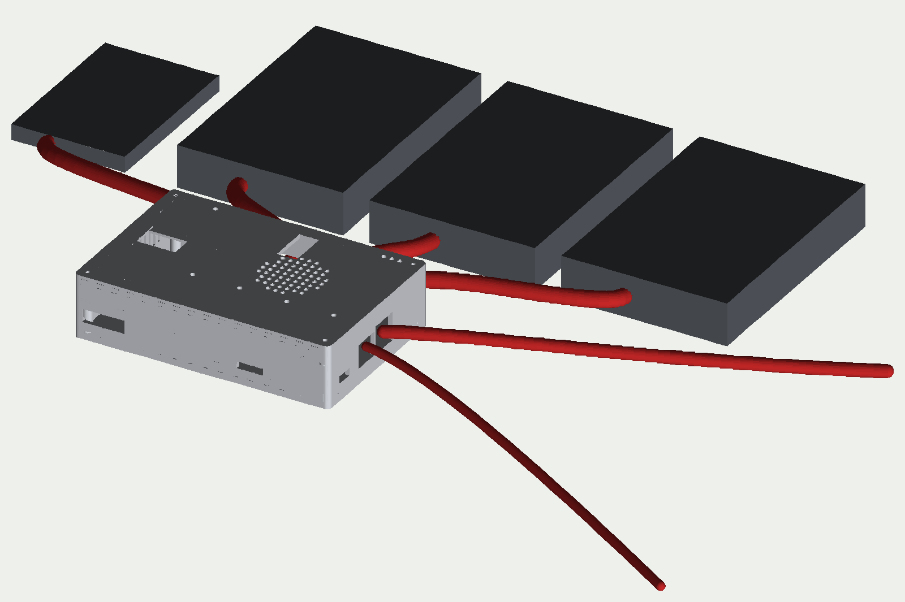

# enclosure — parametric OpenSCAD "brain box"

The unit is a closed printed box (about 157 × 105 × 39 mm outside) that goes in
a backpack with its 12 V brick and four 22-pin cables; drives lie loose on the
bench while they are wiped (decision C21). Printed parts are sized from the real
board:




| Wall | What is on it |
|---|---|
| rear (cable side) | four SATA 22-pin receptacles |
| left | DIN 12 V jack, RJ45, USB-C (rpiboot) |
| front | microSD slot, M.2 SSD slot with a hinged door |
| right | vent slots only |
| lid | OLED window (module on a 4-wire lead, clamped by the bezel), DIP switch slot, 8 LED holes, fan grille over the CM5, four corner screws |
| floor | buzzer sound holes, rubber-feet pockets |

* `board.scad` is **generated** from `hardware/brain-drain.kicad_pcb` by
  `tools/kicad_to_scad.py` (board outline, mounting holes, and the centre of
  every connector, switch and LED the shell must cut). Re-run it whenever the
  board changes.
* `params.scad` holds the printed-part parameters: walls, clearances, heights,
  insert sizes, OLED window position, slot door size.
* `refinements.scad`: hinged M.2 slot door (filament-pin hinge, tray-side
  knuckles on the front wall), OLED bezel, feet pockets.
* `scene.scad`: the render scene (unit, four loose drives, cables).
* `shell.scad`: the tray (board on M2.5 heat-set standoffs, cutouts on three
  walls, vents, floor holes) and the lid.

```
make            # board.scad + stl/tray.stl, lid.stl, door.stl, door_hinged.stl, bezel.stl  (needs openscad)
make renders    # scene STLs and renders/*.png via tools/stl_preview.py (numpy + Pillow, no display needed)
```

Verified 2026-09-23 with OpenSCAD 2021.01: all parts export without warnings.
Tray 156.8 × 104.8 × 36 mm, lid 6.4 mm including its skirt.

Print PETG or ASA, 0.2 mm layers. The tray prints as modelled; the lid prints
upside down.

Known simplifications: cutouts are rectangles sized from nominal connector
faces, so check the DIN jack round face and the SATA plug latch clearance on the
first print; the M.2 slot assumes the SSD slides in flat over the socket's
standoff (the socket is 4.2 mm, the slot is 8 mm high); the OLED lead from J41
to the window over the M.2 column is about 90 mm.
