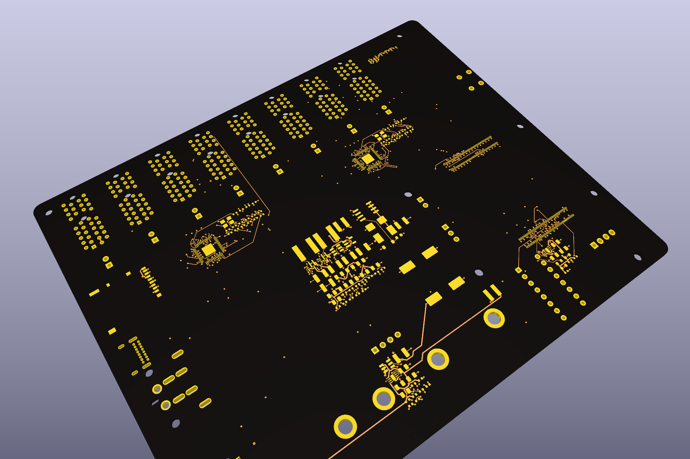

# hardware — CM5 carrier board

KiCad 9 project, **generated** from `tools/design.py`. See `../docs/ARCHITECTURE.md` §3
for the design, `../docs/BOM.md` for parts and `../docs/USAGE.md` for the
regenerate / route commands.



Two boards (C24). **Brain**, 150 × 122 mm: eight bay slots (PCIe x1 sockets) along
the rear edge, hubs behind them, CM5 on the right edge with its antenna edge out,
DIN / USB-C / microSD on the left wall, M.2 front-left under the lid. **Bay card**,
45 × 46 mm in `bay-card/`: ASM1153E, switched 12 V / 5 V, SATA 22-pin receptacle on
top, PCIe-x1 fingers below. Generate either with `BD_PROJECT=brain|card`. Top view with the copper and silkscreen:
[`renders/board-top.png`](renders/board-top.png); bottom side (CR2032 holder, service
headers): [`renders/board-3d-bottom.png`](renders/board-3d-bottom.png).

## Layout

```
hardware/
  brain-drain.kicad_pro / .kicad_sch   root project and root sheet (generated)
  sheets/*.kicad_sch                   14 sheets: power-input, power-bucks, cm5, usb3-hub-A/B,
                                       bridge-1..4, bay-switch-1..4, m2-nvme (generated)
  brain-drain.kicad_pcb                outline, holes, placed footprints, zones, routing (generated + freerouting)
  bay-card/                            the bay card project (same generators, BD_PROJECT=card): .kicad_pro/.sch/.pcb, sheets/, routing/
  CONNECTIONS.md                       net-by-net connection list (generated)
  lib/brain-drain.kicad_sym            project symbols (generated by tools/symgen.py)
  lib/brain-drain.pretty/              project footprints (see its README for origins)
  ref/                                 pin tables (CSV), DOWNLOADS.md; datasheets/ is gitignored
  routing/                             Specctra DSN/SES exchanged with freerouting
  renders/                             schematic PDF + PNGs, board PDF/PNG, 3D render
  bom/brain-drain-bom.csv              canonical BOM (docs/BOM.md is the readable copy)
  tools/                               design.py (netlist), symgen.py, fpgen.py, gen_sch.py,
                                       gen_pcb.py (placement, C21 outline), check_place.py, gen_connections.py,
                                       route.py, render_board.sh, kilib.py, kifp.py, sexp.py
```

## Board rules

* Brain: 6 layers (F sig, In1 GND, In2 sig, In3 sig, In4 power, B sig), 1.6 mm, ENIG, the fab's 6-layer impedance stack-up. Bay card: 4 layers, JLC04161H-7628, ENIG.
* Design rules follow the CM5IO reference: 0.13 mm tracks, 0.125 mm clearance, 0.45/0.2 mm vias
  (power: 0.5 mm tracks, 0.6/0.3 vias). They are written into the project file by `route.py prepare`.
* Diff pairs: USB 3 SS and SATA at 90 Ω (0.147 mm / 0.253 mm gap on the JLC 7628 stack-up), PCIe Gen3 at 85 Ω, USB 2.0 at 90 Ω.
  Intra-pair length match ±0.15 mm. Keep SS/SATA/PCIe pairs on outer layers
  over solid GND, no layer changes without a stitching via.
* CM5 boot-order straps: eMMC/SD only; USB and NVMe boot disabled.
* All bay power switches default **off** (10 k pull-down on each BAY_EN).
* Both input-jack footprints (barrel J20, DIN J21) on the board; populate one.
* Antenna strip x 0–8 mm, y 33–75 mm: no copper on any layer, no parts (rule area set by `route.py prepare`).

## Before fabrication

See `../docs/STATUS.md` R1–R4 and R10: the SATA footprint, the M.2 peg check, the
DIN pinout from the chosen brick, and the hand-routed high-speed pairs.

## Bench validation that does not need this board

Any Linux box + an ASM1153E-based USB dock answers the risky questions:
does `hdparm --sanitize-*` pass through, does the bridge survive a long
SECURITY ERASE, does `--sanitize-status` report progress. A Pi 5 with two docks is the exact
software test bed for this topology. Do this first.
